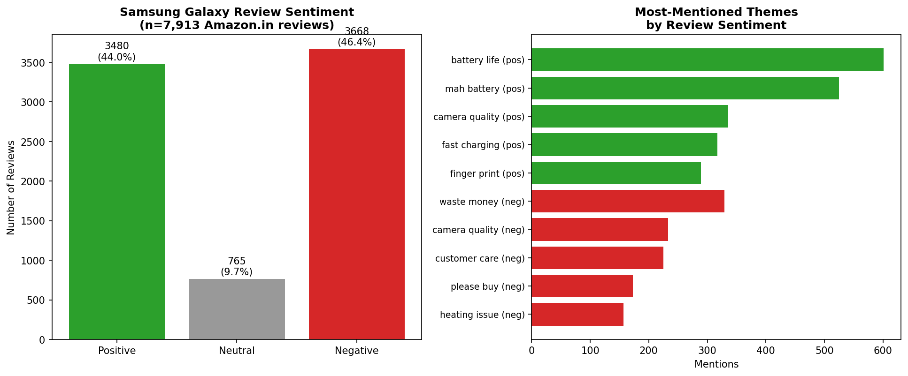

# Samsung Galaxy Consumer Review Sentiment & Theme Analysis

Analysis of **7,913 real Samsung Galaxy customer reviews** scraped from Amazon.in, uncovering
what actually drives positive vs. negative sentiment — beyond a simple polarity score.



## Why this project

Most beginner sentiment-analysis projects stop at "X% positive, Y% negative." This one goes
further: it identifies *which specific product and service themes* are driving that sentiment,
the way a Consumer Insights analyst would frame it for a product or marketing team.

## Key Findings

- Sentiment is nearly split: **44% positive vs. 46.4% negative** — a polarized customer base,
  not uniform satisfaction.
- **Camera quality** and **battery life** are the most-discussed features in *both* positive and
  negative reviews — they're the biggest expectation-setters, not universally loved or hated.
- **51% of negative reviews** mention return, replacement, or delivery language — a meaningful
  share of dissatisfaction is about the post-purchase experience, not the device itself.
- "Heating issue" and "customer care" are distinct, recurring complaint clusters specific enough
  to route to product and support teams respectively.

Full write-up: [insight_summary.md](insight_summary.md)

## Methodology note (and a deliberate correction)

The first approach used VADER sentiment scoring directly on review text. Validating that output
against actual star ratings surfaced a problem: ~1,000 one-star reviews were being scored as
"Positive." The cause was the source dataset's text had already been stemmed and stripped of
punctuation/stopwords, which destroys the negation and intensity cues VADER relies on (e.g.
"not good" becomes just "good" once "not" is removed as a stopword).

Since star ratings were available as reliable ground truth, sentiment was reassigned from star
rating directly (1-2★ Negative, 3★ Neutral, 4-5★ Positive), and text mining (bigram frequency)
was used separately to explain *why* — which is arguably a better-designed approach regardless.

## Data

- **Source:** [msiddhu/sentiment-analysis_on_phone-reviews](https://github.com/msiddhu/sentiment-analysis_on_phone-reviews)
  (public dataset, reviews scraped from Amazon.in)
- **Scope:** Filtered to Samsung Galaxy models only — 7,913 reviews across 10 models

## Tech Stack

Python · Pandas · NumPy · Matplotlib · Regex-based text mining

## Run it yourself

```bash
pip install pandas numpy matplotlib
python sentiment_analysis.py
```

Requires `phone_reviews.csv` in the same directory (see Data section for source).

## Files

- `sentiment_analysis.py` — full pipeline: load, clean, label, mine themes, chart
- `insight_summary.md` — the business-facing write-up
- `samsung_sentiment_analysis.png` — output chart
